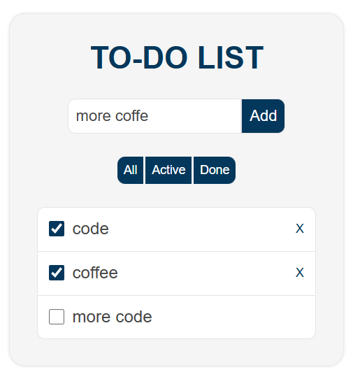

A clean, responsive, To-Do List built with **HTML**, **CSS**, and **Vanilla JavaScript** (DOM manipulation).  
This project demonstrates my ability to build interactive web interfaces with modern design and clear code structure.

---

## ✨ Features

- ✅ Add new tasks
- 🗑️ Delete tasks
- 📋 Mark tasks as completed
- 🔍 Filter by **All**, **Active**, or **Completed**
- 💾 Built with only HTML/CSS/JS — no frameworks
- 🎯 Designed with simplicity and professionalism in mind

---

## 📸 Preview



---

## 🧠 What I Learned

As a junior developer, this project helped me understand and practice:

- How to manipulate the **DOM** with JavaScript
- How to structure a basic **component-like layout**
- How to use **CSS Flexbox** for responsive UI
- Writing **clean, readable code**
- Building features that reflect real user needs

---
## 🌐 Live Demo

[👉 View Live Demo](https://lu-alvz-dev.github.io/modern-todo-webapp/) 

## 🚀 How to Run It

You can run this project locally by following these simple steps:

1. Download or clone this repository:

```bash
git clone https://github.com/yourusername/todo-list-js.git
