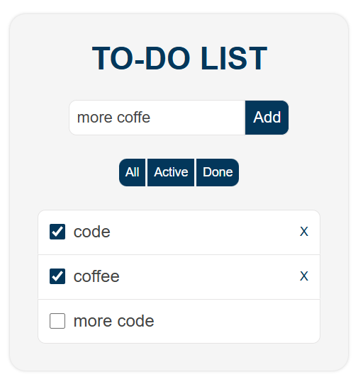

# Modern To-Do Web App (Refactored)

A clean, responsive, To-Do List built with **HTML**, **CSS**, and **Vanilla JavaScript** (DOM manipulation).  
This project demonstrates my ability to build interactive web interfaces with modern design and clear code structure.

This project was originally developed as a single-file JavaScript application and later **refactored into a modular architecture** to improve maintainability, scalability, and code clarity.

---

## Features

- Add new tasks
- Delete tasks
- Mark tasks as completed
- Filter by **All**, **Active**, or **Completed**
- No frameworks
- Designed with simplicity and professionalism in mind
- Persistent storage using localStorage
- Responsive layout

---

## Overview

The goal of this refactor was to simulate a real-world scenario where an existing codebase needs to be improved without breaking functionality.

Instead of rewriting the application, the focus was on:

- Improving code structure
- Separating concerns
- Making the code easier to maintain and extend

---

## Key Improvements

- Refactored simple one-file JavaScript into modular files
- Separated responsibilities (DOM, logic, storage, filtering)
- Improved naming and readability
- Added input validation
- Preserved original functionality

---

## Project Structure

src/js/

- app.js → main application logic
- dom.js → DOM manipulation
- storage.js → localStorage handling
- filter.js → task filtering logic

---

## Relevance

This project simulates working with an existing codebase and improving it incrementally, which reflects real frontend work flow.

---

## Preview



---

## Technologies

- HTML
- CSS
- JavaScript (Vanilla)

---

## What I Learned

- Refactoring existing code without breaking functionality
- Structuring applications using modular JavaScript
- Separating concerns for better maintainability
- Improving code readability and organization
- Applying good development practices

---

## Live Demo

[ View Live Demo](https://lu-alvz-dev.github.io/modern-todo-webapp/)

## How to Run It

You can run this project locally by following these simple steps:

1. Download or clone this repository:

```bash
git clone https://github.com/yourusername/todo-list-js.git
```
